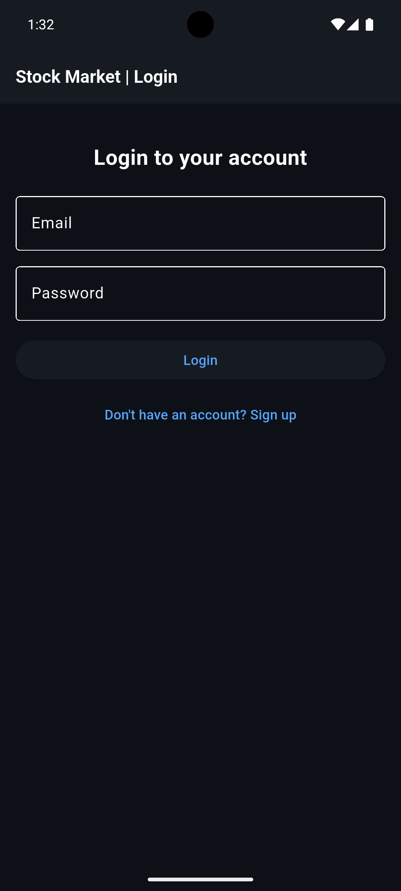
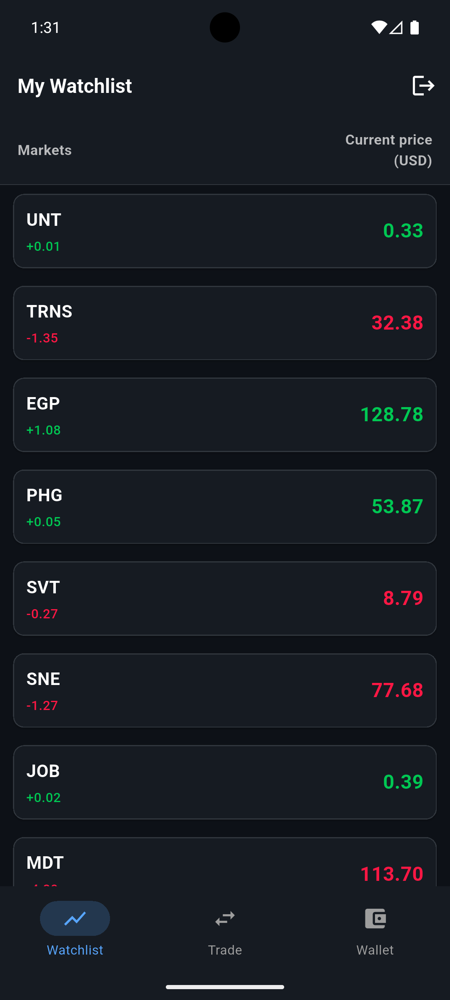
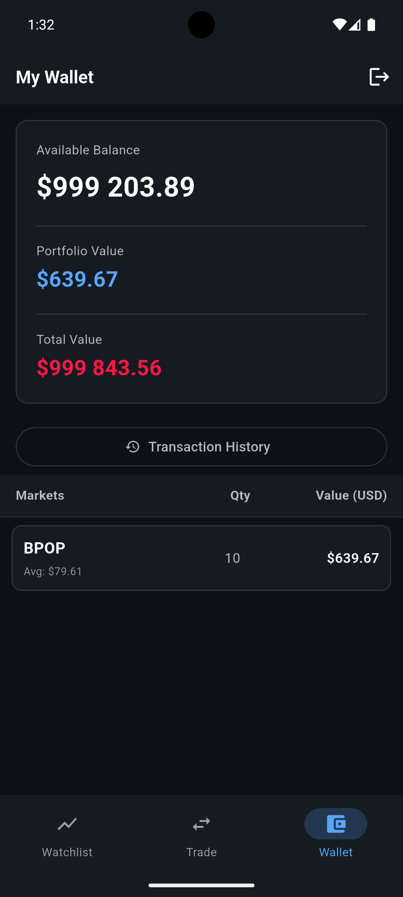
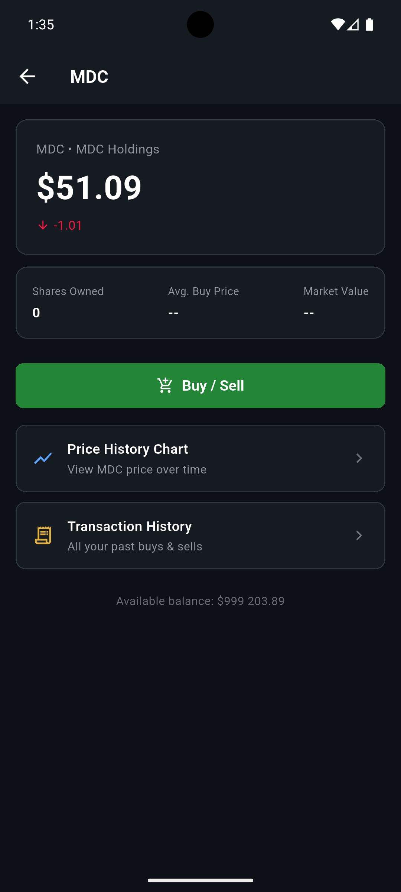
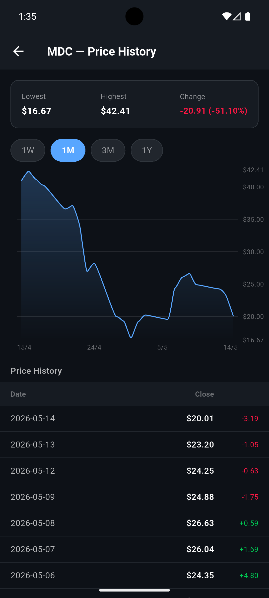
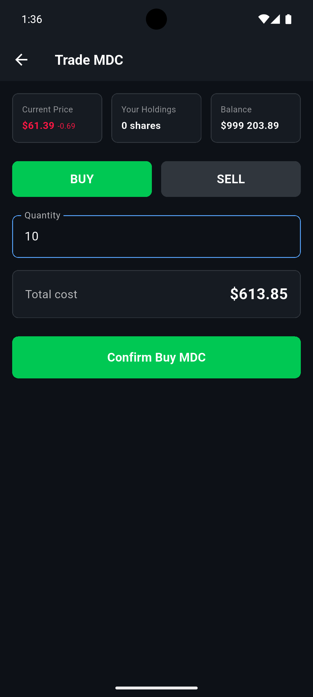

# 📈 Stock Market Simulator

A Flutter app that simulates a real-time stock market with live prices, stock trading, wallet tracking, and historical charts. Users can sign up, receive $1,000,000 in virtual funds, and trade 20 monitored stocks in a clean and simple interface.

[](https://flutter.dev)
[](https://dart.dev)
[]()

---

## Overview

Stock Market Simulator is an educational trading app built with Flutter. It connects to a mock stock server to show live prices, historical data, and portfolio changes in real time. The app is designed to help users practice trading logic without using real money.

---

## Screenshots

Add your app screenshots here.

| Login | Watchlist | Wallet |
|---|---|---|
|  |  | |

| Stock Details | Price History | Trade |
|---|---|---|
|  |  |  |

---

## Features

- Login and signup.
- Welcome screen with short delay.
- Main navigation for switching between pages.
- Real-time watchlist with 20 monitored stocks.
- Wallet page with holdings and fake cash balance.
- Stock details page with live price.
- Historical data page with chart.
- Buy and sell stock actions.
- Local storage for users, holdings, and transactions.

---

## Project Structure

```text
stock-market/
├── frontend/                                <- Flutter app
│   ├── lib/
│   │   ├── main.dart                        <- app entry point
│   │   ├── screens/
│   │   │   ├── login_screen.dart            <- login / signup page
│   │   │   ├── welcome_screen.dart          <- short welcome page (2 sec)
│   │   │   ├── nav_screen.dart              <- main navigation control
│   │   │   ├── watchlist_screen.dart        <- 20 monitored stocks (real-time)
│   │   │   ├── wallet_screen.dart           <- owned stocks + fake balance
│   │   │   ├── transaction_screen.dart      <- transaction history
│   │   │   ├── stock_details_screen.dart    <- stock details + current price
│   │   │   ├── history_screen.dart          <- historical data + chart
│   │   │   └── trade_screen.dart            <- buy / sell stock
│   │   ├── providers/
│   │   │   ├── auth_provider.dart           <- login / signup state
│   │   │   ├── stocks_provider.dart         <- watchlist + real-time updates
│   │   │   ├── wallet_provider.dart         <- holdings + balance state
│   │   │   ├── nav_provider.dart            <- app navigation state
│   │   │   └── history_provider.dart        <- historical data state
│   │   ├── widgets/
│   │   │   └── stock_chart.dart             <- historical chart widget
│   │   ├── db/
│   │   │   └── local_db.dart                <- SQLite setup for users, holdings, transactions
│   │   └── utils/
│   │       ├── constants.dart               <- mock-server base URL, config
│   │       └── formatters.dart              <- price/date formatting
│   └── pubspec.yaml
│
├── mock-server/                             <- mock stock data server
│   ├── app.py                               <- Python Flask server
│   ├── Makefile                             <- make run / make stop
│   ├── start.sh                             <- script to run the server
│   ├── requirements.txt
│   ├── sample-stocks/
│   └── utils.py
│
├── docs/
│   ├── audit-notes.md                       <- checklist notes
│   └── chosen-stocks.md                     <- list of 20 monitored stocks
│
└── README.md                                <- project description
```

---

## Tech Stack

- **Frontend:** Flutter
- **State Management:** Provider ^6.1.5
- **Backend:** Python Flask mock server
- **Local Storage:** SQLite (sqflite ^2.3.3+1)
- **Charts:** fl_chart ^1.2.0
- **HTTP:** http ^1.2.2
- **Formatting:** intl ^0.20.2
- **Secure login/signup:** crypto ^3.0.3
---

## How It Works

1. A user signs up or logs in.
2. The app gives the user $1,000,000 in fake money.
3. The watchlist shows 20 monitored stocks with live updates.
4. The user can open a stock, view its history, and trade it.
5. The wallet updates automatically after each buy or sell action.

---

## Getting Started

### Prerequisites

- Flutter SDK
- Dart SDK
- Python 3.10+ for the mock server

### Run the frontend

```bash
cd frontend
flutter pub get
flutter run
```

### Run the mock server

```bash
cd mock-server
pip install -r requirements.txt
python app.py
```

### Environment Setup

The mock server runs on port **5001**. Update the base URL depending on how you run the app:

**iOS Simulator or Desktop**
```dart
const String baseUrl = 'http://localhost:5001';
```

**Android Emulator**
```dart
const String baseUrl = 'http://10.0.2.2:5001';
```

> **Android Emulator Rule**: `10.0.2.2` is a **special address** that **always points to your computer's localhost** from inside the emulator. This works on **Windows, Mac, Linux** — any computer running Android emulator.  
> iOS Simulator and desktop use `localhost` normally.

---

## Dependencies


| Package           | Purpose                |
| ----------------- | ---------------------- |
| `provider: ^6.1.5` | State management       |
| `sqflite: ^2.3.3+1` | Local database         |
| `path: ^1.9.0`      | File paths             |
| `http: ^1.2.2`      | API requests           |
| `crypto: ^3.0.3`    | Password hashing       |
| `intl: ^0.20.2`     | Date/number formatting |
| `fl_chart: ^1.2.0`  | Stock charts           |
---

## Authors
[Kateryna Ovsiienko](https://github.com/mavka1207)

[Mayuree reunsati](https://github.com/mareerray)

This project is for educational purposes. 
